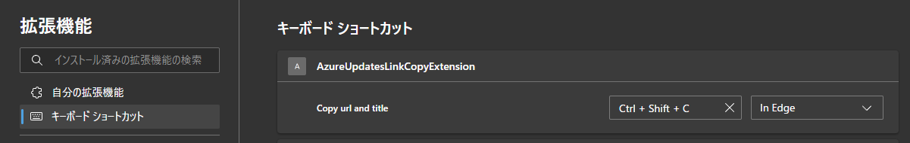

# Azure Updates のサイトからURLとタイトルをコピーするやつ

https://azure.microsoft.com/en-us/updates なページ上で `Ctrl+Shift+C` するとURLとタイトルをクリップボードに入れてくれるやつ。

## インストール

- 拡張機能の開発者モードをOnにして `src` フォルダを指定して展開する。
- キーボードショートカットを割り当てる
  

